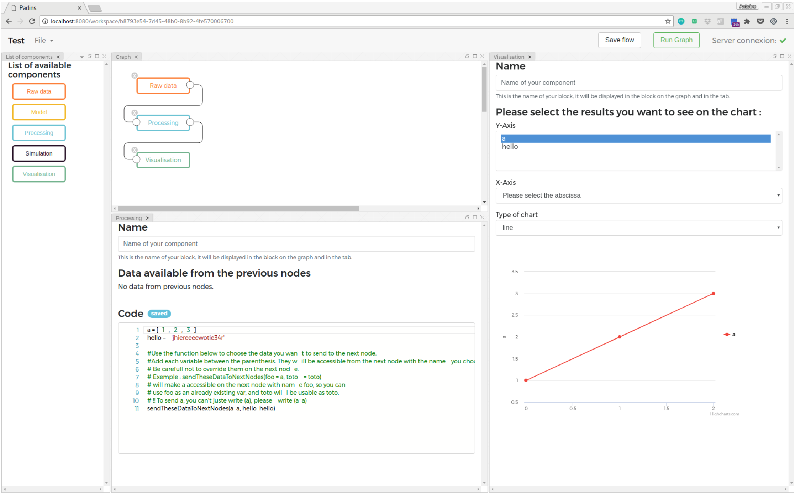

> **Warning** : this section **targets developers**. If you want to know how to install and use Padins, please go to the [gettting started](/padins-backend/guide/installation.html) section.

<h2><a href="#technologies-used" id="technologies-used">Technologies used</a></h2>

Padins is built with the following technologies. Knowing that will help you understand the following explanations. If you don't know them, please refer to their websites in order to discover how they are built and work when they are mentionned. 
* Frontend : [Angular 4](https://angular.io)
* Backend : [Eclipse Jetty](http://www.eclipse.org/jetty/) Webserver
* Backend's API : Embedded Jetty Technologies with [Javax Http Servlets](https://tomcat.apache.org/tomcat-5.5-doc/servletapi/javax/servlet/http/HttpServlet.html)
* Websocket, server-side : [Jetty Websockets](http://www.eclipse.org/jetty/documentation/9.4.x/jetty-websocket-server-api.html)
* Websocket, client-side : [Javascript's Websocket](https://developer.mozilla.org/en-US/docs/Web/API/WebSockets_API)
* Python Execution Environment : [Jupyter Kernel](http://jupyter.readthedocs.io/en/latest/projects/kernels.html)
* [Docker](https://docker.com)

<h2><a href="#selecting-a-project" id="selecting-a-project">Selecting a project</a></h2>

In Padins, users can create several projects. Each project has its own workspace, containing the workflow's information and all the files the user uploaded. Exactly as in a popular Integrated Development Environment (IDE) such as IntelliJ or Eclipse. All the data are stored on the server. When a user connects to the app, the app request the server for the list of available worspaces and display them.

Then, when the user selects a Workspace, the app redirect to the Workspace view. Here, the app connects a websocket to the server in order to access the workspace's data and communicate about workflow's changes in real-time. Several users can be connected on the same workspace at the same moment. 

A word about the websocket connexion itself. Padins uses a unique endpoint that is `ws://{server-ip-address}:8080/ws`. The subprotocol field is used to connect to the right workspace, with the workspace's unique id. The webserver only verifies that the workspace exists. If so, it accepts the connexion request. 

> For the moment, the user authentication is not implemented at all. So, anyone can access to all the workspaces.

*The user can also create a new project.*

<h2><a href="#how-workflows-are-designed" id="how-workflows-are-designed">How workflows are designed ?</a></h2>

The core of Padins is the workflow itself. Each workspace has only one workflow that is represented as a `flow.json` file at the root of the workspace's folder *(moving it into an hidden folder might be a good idea)*. To design the workflow, the user can use some predefined components that are downloaded when opening the workspace. 

Those components are organised in libraries. You can find these libraries in `padins-backend/src/main/resources/default_storage_directory_content.zip/WebUIComponents/`. The library used by default is `hydro-geology.json`. You can see an example of a components library file [here](/padins-backend/examples/component-library-file.html).

After the user clicks a component in the list of available components (on the left on the below screenshot), a new node is created from the component and added into the workflow. Then, when the user double-clicks on a node, its detailed-view appears. Still on the below screenshot, the window you can see with the code editor belongs to the 'processing' node, and the window with the chart belongs to the 'visualization' node. 

A user can add as many nodes in the workflow as she wants to. Then, she can links components together. A component can have as many dependencies as the user wants, and be the dependence of as many components as the user wants. The only condition is that the graph must stay directed and acyclic, which means that it can't contain any loop. 

Components are customizable in their own way. Let's take a look at all the components already implemented : *Raw Data*, *Processing*, *Simulation*, *Visualization*. 

#### Raw Data

It allows a user to import data from as many JSON files as she wants and rename the data she needs to. This component has only an outport, its not possible to input data in it in another way than uploading files. All the imported data will be automatically available to all the nodes connected to it. 

#### Processing and Simulation

For the moment those nodes behave exactly in the same way. The original idea is that the processing component is made to add pre-processing and post-processing of the simulation's data when needed. Theses processings are assumed pretty short to compute, so they are supposed to be runned as soon as they are modified, in order to run the simulation faster. 

This components offers a Python code editor. The user has nothing to change in her developments habits, the code is stricly the same as in any other Python IDE. The only difference is that in order to send data to the next nodes, all the data to transfer must be passed as parameters of a function name `sendTheseDataToTheNextNodes()` at the end of the file. 

#### Visualization

This component makes available all its input data for displaying on a chart. It also has the ability to display a matrice as a video, very useful to see the temporal behavior of a physical system. 

#### Combining components

Combining these basic components, it is possible to build Python program very easily and quickly with the benefits coming from combining a textual programming language and a graphical programming language. 

#### How to develop new components ?

**TODO in another section**

<h2><a href="#how-workflows-are-executed" id="how-workflows-are-executed">How workflows are executed ?</a></h2> 

Here we dive into the most interesting part of what Padins does. 

